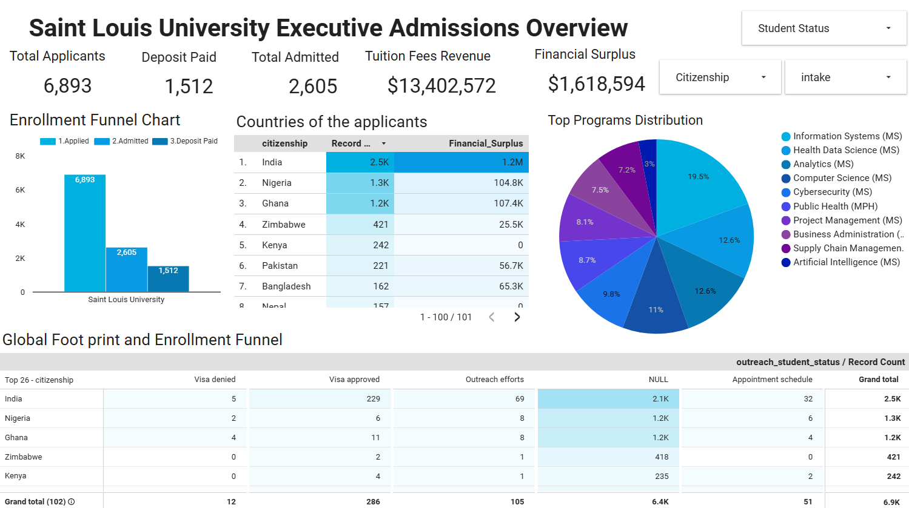

<!-- Banner / Intro Typing SVG -->

---

# 👋 About Me

Hi, I'm **Proud Ndlovu** (GitHub: **ApostolicDA**) — a **Data Analyst & Business Intelligence Specialist** focused on transforming complex datasets into clear, actionable insights that support strategic decision-making.

My work centers around building **data pipelines, analytical datasets, and executive dashboards** that help organizations understand performance, identify opportunities, and make data-driven decisions.

I specialize in the full analytics lifecycle:

**Raw Data → Data Cleaning → Data Modeling → Analysis → Executive Dashboards**

🔹 Based in **Johannesburg, South Africa**  
🔹 Experienced with **SQL, Python, Power BI, and Looker Studio**  
🔹 Focused on **business intelligence, analytics engineering, and KPI reporting**  
🔹 Passionate about turning messy operational data into **reliable business insights**

---

# 🧰 Core Skills

### Data Analysis & Analytics Engineering

**Capabilities**

- Data cleaning and transformation
- SQL data modeling
- Exploratory Data Analysis (EDA)
- KPI development and validation
- Analytical dataset creation
- Business performance analysis

---

### Business Intelligence & Data Visualization

**Capabilities**

- Executive dashboards
- KPI reporting frameworks
- Business performance monitoring
- Funnel analysis
- Data storytelling for stakeholders

---

### Data Workflow & Development Tools

---

# 🚀 Featured Analytics Projects

### 🎓 Governed Admissions Intelligence Pipeline
End-to-end analytics system integrating multiple admissions datasets into a **PostgreSQL warehouse powering a validated BI dashboard**.

**Key Work**

- Integrated 4 operational datasets into a governed analytical model  
- Engineered a **master dataset using SQL transformations**  
- Built a **Looker Studio executive dashboard**  
- Implemented **SQL-based KPI validation framework**

**Skills Demonstrated**

SQL • Data Modeling • ETL • Data Governance • BI Dashboarding

🔗  
[Check Out My Governed-Admissions-Intelligence-Pipeline Project](https://github.com/ApostolicDA/Governed-Admissions-Intelligence-Pipeline)

---

### 💰 Marketing ROAS Analytics Engine

SQL-driven analytics system designed to measure and optimize **marketing return on ad spend (ROAS)** across campaigns.

**Key Work**

- Built SQL queries calculating **ROAS, CAC, LTV, churn risk, and channel profitability**
- Developed **multi-table analytical model using CTEs and window functions**
- Created BI-ready datasets supporting executive performance monitoring

**Skills Demonstrated**

SQL • Marketing Analytics • KPI Modeling • Performance Analysis

🔗  
[Check Out My Roas Analytics Project](https://github.com/ApostolicDA/roas-analytics-sql)

---

### 🛡 Fraud Detection & Risk Analysis (Python + SQL)

Exploratory analytics project investigating fraudulent transaction patterns using **Python and SQL-based analysis**.

**Key Work**

- Cleaned and validated financial transaction datasets
- Identified **fraud rate (10.61%) and total financial exposure**
- Performed segmentation analysis revealing **fraud concentration patterns**

**Skills Demonstrated**

Python • Data Cleaning • Exploratory Data Analysis • Risk Analytics

🔗  
[Check Out My Fraud Detection Project](https://github.com/ApostolicDA/fraud-detection-eda)

---

# 💡 What I Bring as a BI / Data Analyst

| Capability | Business Value |
|------------|---------------|
| **Data Cleaning & Transformation** | Ensures accurate and reliable datasets |
| **SQL Analytics & Modeling** | Converts raw operational data into structured analytical datasets |
| **Dashboard Development** | Enables executives to monitor KPIs and performance in real time |
| **KPI Validation & Governance** | Ensures dashboard metrics accurately reflect source data |
| **Insight Generation** | Translates complex data into actionable recommendations |

---

# 📚 Education & Certifications

| Qualification | Institution | Year |
|---|---|---|
| Advanced Diploma – Data Science & Machine Learning | Alison | 2023–2025 |
| Data Analytics Bootcamp | aLex Data | 2025 |
| Microsoft Power BI Data Analyst (PL-300) | NEMISA | In Progress |

---

⭐ **Goal:** Build data systems and dashboards that help organizations move from **raw data to confident decisions.**
